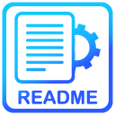

<br/>
<p align="center">
  <a href="https://github.com/jenkins96/perfectphoto">
    
  </a>

  <h3 align="center">README</h3>

  <p align="center">
    Every Project Teach Us Something!
    <br/>
    <br/>
    <a href="https://github.com/jenkins96/perfectphoto"><strong>Explore the docs »</strong></a>
    <br/>
    <br/>
    <a href="https://github.com/jenkins96/perfectphoto">View Demo</a>
    .
    <a href="https://github.com/jenkins96/perfectphoto/issues">Report Bug</a>
    .
  </p>
</p>

   

## Table Of Contents

* [About the Project](#about-the-project)
* [Built With](#built-with)
* [Getting Started](#getting-started)
  * [Prerequisites](#prerequisites)
  * [Installation](#installation)
* [Usage](#usage)
* [Contributing](#contributing)
* [Authors](#authors)
* [Acknowledgements](#acknowledgements)

## About The Project


Write about the project

## Built With

* PHP
* JavaScript
* MySQL
* HTML
* CSS
* Bootstrap
* Jquery
* Google Fonts
* Google Maps
* PHPMailer
* XAMPP


## Getting Started

This is an example of how you may give instructions on setting up your project locally.
To get a local copy up and running follow these simple example steps.

### Prerequisites

The only thing you need is a Web Server. Although if you want to run the entire project you will need a RDBMS as well. In my case, I used 'XAMPP' and 'phpmyadmin' as a administration tool for MySQL.  

### Installation
Assuming you are using 'XAMPP' as Web Server

1. Clone the repo

```sh
git clone https://github.com/your_username_/Project-Name.git
```
2. Save the file in:

```sh
xampp/htdocs
```
3. Start the server and type in your browser:

```sh
localhost/perfectphoto
```


## Usage

A couple of screenshots:


## Authors

* **Adrian Jenkins** - ** - [Adrian Jenkins](https://github.com/jenkins96) - *Built ReadME Template*

## Acknowledgements

* [ShaanCoding](https://github.com/ShaanCoding/)
* [Othneil Drew](https://github.com/othneildrew/Best-README-Template)
* [ImgShields](https://shields.io/)


## Copyright and License

Copyright 2013-2015 Iron Summit Media Strategies, LLC. Code released under the [Apache 2.0](https://github.com/IronSummitMedia/startbootstrap-business-casual/blob/gh-pages/LICENSE) license.